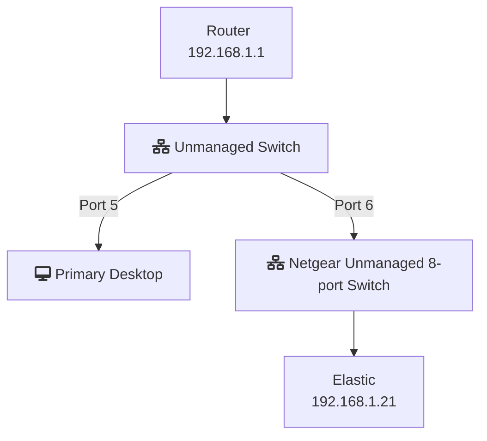

# infrastructure-home


## TODO
- Instructions for installing docker and docker-compose on pi4 64-bit


## Run Elasticsearch & Kibana on PI4 64-bit

### Install Docker Compose
Reference: https://docs.docker.com/compose/install/#install-compose

Find most recent version for ARM64 architecture on releases page: https://github.com/docker/compose/releases

Grab artifact using curl and save as docker-compose:
```bash
sudo curl -L https://github.com/docker/compose/releases/download/v2.3.3/docker-compose-linux-aarch64 -o /usr/local/bin/docker-compose
```

```bash
sudo chmod +x /usr/local/bin/docker-compose
```

```bash
sudo ln -s /usr/local/bin/docker-compose /usr/bin/docker-compose
```

### Fetch Compose YAML

```bash
wget https://raw.githubusercontent.com/ngourley/infrastructure-home/main/elastic-compose.yaml
```

### Start stack
#### Initialize with docker-compose specifying configuration, and in a detached state
```bash
docker-compose -f elastic-compose.yaml up -d
```


